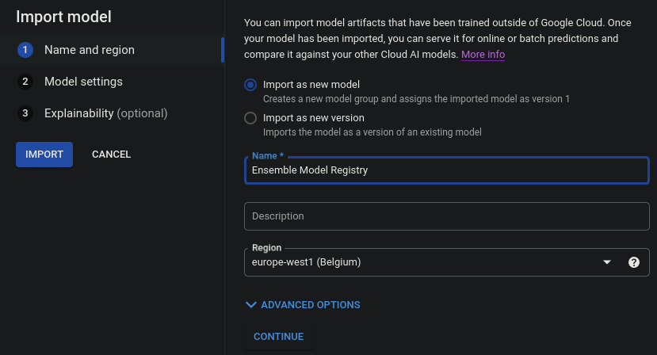

## Part 1 & Part 2
Created a [Jupyter Notebook](EnsembleInTheLocal.ipynb) which builds an ensemble model with the functions
mentioned in the assignment description.

## Part 3 - Ensemble Learning in the Cloud
### Convert your Jupyter Notebook into a Python script
I did this [locally](EnsembleInTheCloud.py) with the following commands.
```
pip install nbconvert
jupyter nbconvert EnsembleInTheCloud.ipynb --to python
```

Afterwards I simply uploaded the python script to the '/src/trainer' folder.

And removed the following lines from the top of the file.
```
#!/usr/bin/env python
# coding: utf-8
```

### Training the model in the cloud

First I created a Dockerfile under '/src/Dockerfile'.

```
FROM ubuntu:20.04

COPY . /app

WORKDIR /app

RUN apt-get update && apt-get install -y python3 python3-pip

RUN pip install -r requirements.txt

ENTRYPOINT ["python", "trainer/EnsembleInTheCloud.py"]
```

And afterwards I did a series of actions by following the tutorial given.  

Everything was done in the cloud terminal.

First I acquired the id of the project I'm currently residing in.
```
gcloud config list --format 'value(core.project)'
```

Then I created a repo in Artifact Registry.

```
REPO_NAME='ensemble-app'

gcloud artifacts repositories create $REPO_NAME --repository-format=docker --location=europe-west1 --description='Docker Repository'
```

Then I built the Docker container and pushed it to the Artifact Registry.

```
IMAGE_URI=europe-west1-docker.pkg.dev/$PROJECT_ID/$REPO_NAME/ensemble_image:latest

gcloud auth configure-docker europe-west1-docker.pkg.dev

docker build ./ -t $IMAGE_URI

docker push $IMAGE_URI
```

Once the Docker Image was pushed to the Artifact Registry I could start the model deployment on Vertex AI.  

Step-by-step process:

Model Development -> Training


After the Training has been completed, we move forward.  

Deploy and Use -> Model Registry

Import model.




Deploy and Use -> Endpoints

Create an endpoint.


And finally we test the endpoint.  

First we have to get the project and endpoint id.  


## Submission
### Submission Files
[The Jupyter Notebook from Part 1 & 2](EnsembleInTheLocal.ipynb)

[The Python script from Part 3](EnsembleInTheCloud.py)

[The Dockerfile from Part 3](Dockerfile)

[The use of the endpoint in a Jupyter Notebook](EnsembleInTheCloudEndpoint.ipynb)

### Submission Screenshots

The file structure of the Jupyter Lab in the Workbench.


The training job in the Training section of the Vertex AI platform.


The model in the Model Registry section of the Vertex AI platform.


The endpoint in the Endpoints' section of the Vertex AI platform.


Prediction


